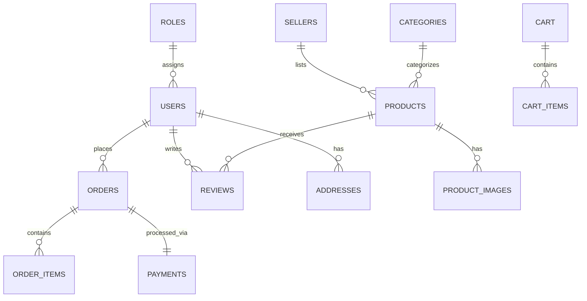

# ABIMART Entity-Relationship Diagram

```mermaid
erDiagram
    USERS ||--o{ ORDERS : places
    USERS ||--o{ REVIEWS : writes
    USERS ||--o{ ADDRESSES : has
    ROLES ||--o{ USERS : assigns
    SELLERS ||--o{ PRODUCTS : lists
    CATEGORIES ||--o{ PRODUCTS : categorizes
    PRODUCTS ||--o{ REVIEWS : receives
    PRODUCTS ||--o{ PRODUCT_IMAGES : has
    CART ||--o{ CART_ITEMS : contains
    ORDERS ||--o{ ORDER_ITEMS : contains
    ORDERS ||--|| PAYMENTS : processed_via
```
