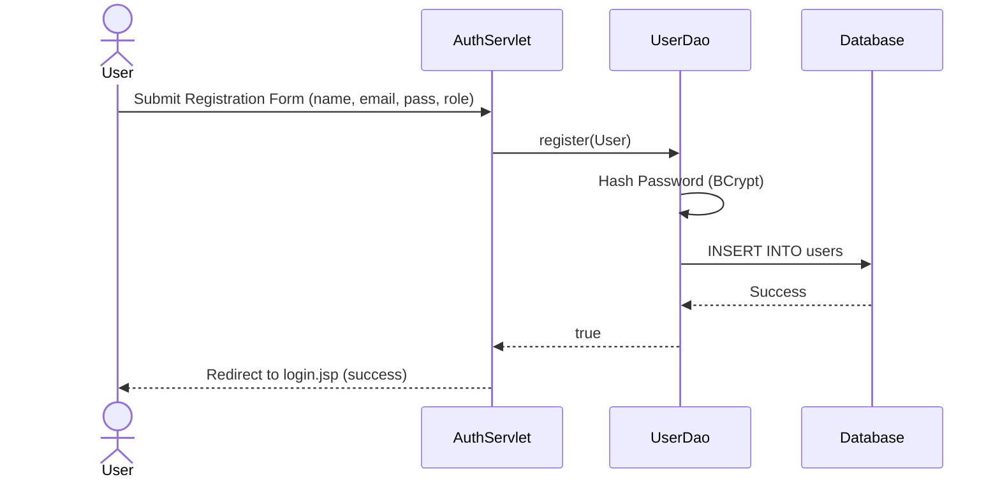
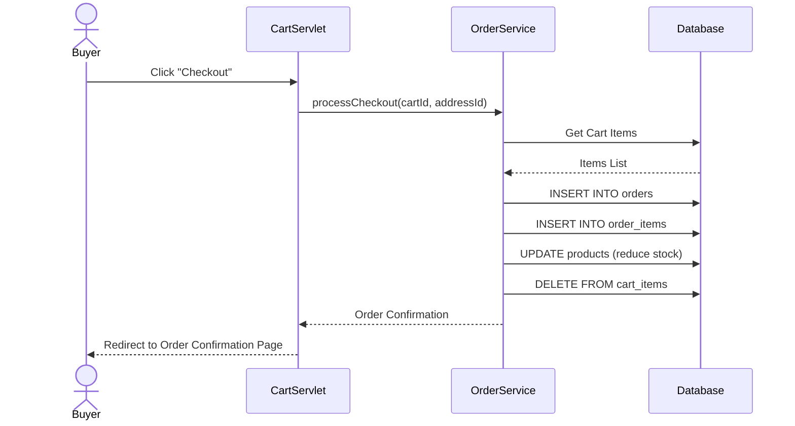

# ABIMART Sequence Diagrams

## 1. Registration Sequence

```mermaid
sequenceDiagram
    actor User
    participant AuthServlet
    participant UserDao
    participant Database

    User->>AuthServlet: Submit Registration Form (name, email, pass, role)
    AuthServlet->>UserDao: register(User)
    UserDao->>UserDao: Hash Password (BCrypt)
    UserDao->>Database: INSERT INTO users
    Database-->>UserDao: Success
    UserDao-->>AuthServlet: true
    AuthServlet-->>User: Redirect to login.jsp (success)
```

## 2. Checkout Sequence

```mermaid
sequenceDiagram
    actor Buyer
    participant CartServlet
    participant OrderService
    participant Database

    Buyer->>CartServlet: Click "Checkout"
    CartServlet->>OrderService: processCheckout(cartId, addressId)
    OrderService->>Database: Get Cart Items
    Database-->>OrderService: Items List
    OrderService->>Database: INSERT INTO orders
    OrderService->>Database: INSERT INTO order_items
    OrderService->>Database: UPDATE products (reduce stock)
    OrderService->>Database: DELETE FROM cart_items
    OrderService-->>CartServlet: Order Confirmation
    CartServlet-->>Buyer: Redirect to Order Confirmation Page
```
